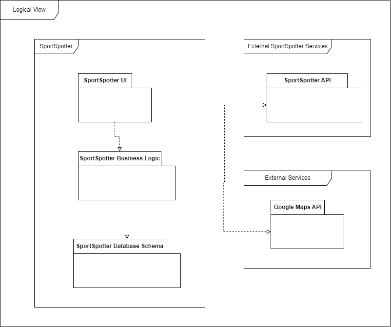
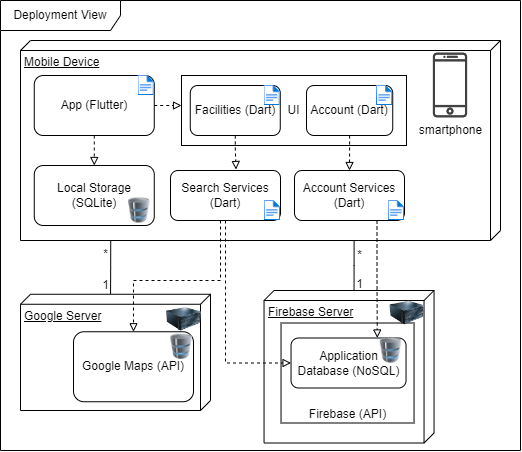
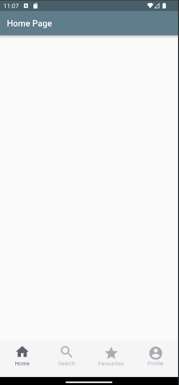
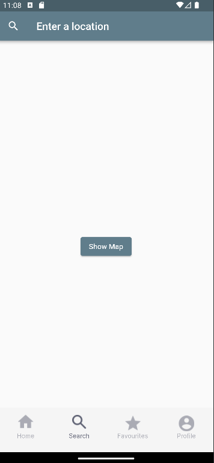
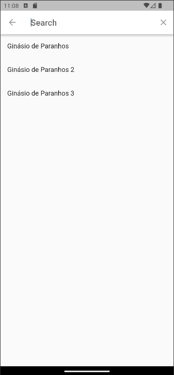
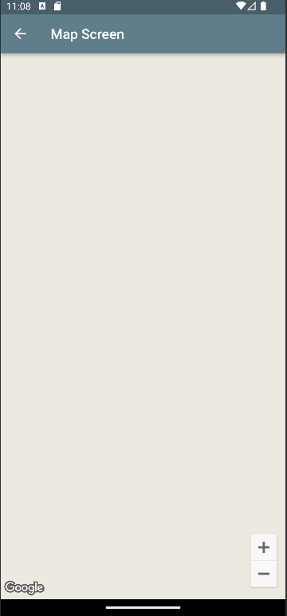

## Architecture and Design

In this section we'll describe the logical and physical architectures of our project.

### Logical architecture
In order to provide maintenance of the code and a good organization, our project was divided in these sections:
- `SportSpotter`: This package represents the top-level package for the application on the smartphone. It contains the other logical packages that make up the system.

- `SportSpotter UI`: This package contains the frontend logic for the application, including user interface components.

- `SportSpotter Business Logic`: This package contains the user-side business logic, and API calls to the backend.

- `SportSpotter Database Schema`: This package contains the local database logic and API.

- `External SportSpotter Services`: This package represents the top-level package for the external services to the smartphone. It contains the other SportSpotter services that make up the system.

- `SportSpotter API`: This package contains the backend logic for the application, including database access and business rules.

- `External Services`: This package represents the top-level package for external services application depends on. It contains other logical packages that make up the system.

- `Google Maps API`: This package contains the Google Maps API.

### Physical architecture
- `Mobile Device`: This is the top-level node that represents the application system in a smartphone.

- `App`: This artifact represents the application software using flutter framework software that is installed on the client devices and used to build and run the system's mobile application.

- `Locale Storage`: This artifact represents the local database on the client devices. It includes the SQLite software that is installed on the client devices.

- `Software Application Server`: This is the top-level node that represents the application backend system, installed in a server.

- `Account`, `Facilities`, `Account Services` and `Search Services`: These artifacts represent all the dart files that contains the backend logic for the application.

- `Application Database`: This artifact represents the database associated with the server. It uses NoSQL and is implemented using Firebase.

- `Google Server`: This node represents the Google's server.

- `Google Maps`: This artifact represents the Google Maps system and database.

### Vertical prototype
We started by creating a navigation bar to navigate between the different pages of the mobile application. We implemented this feature by creating a NavigationWidget class that allows the user to move to the respective application screen after clicking on one of the icons in the navigation bar. When the user clicks on one of the icons in the navigation bar, that icon changes color.

On the search page screen, we added a search bar that allows the user to input a certain location, with access to some predefined options. We implemented this feature by creating a SearchScreen class and a CustomSearch class that allow the user to enter text in the search bar using the keyboard.

In order to establish the connection with the Google Maps API, we started by adding the respective dependency to the pubspec.yaml file. After installing the packages, we imported them into the .dart file corresponding to the search page of the mobile application. Lastly, a button was added to the search page that allows the user to open a window that shows the map screen through the Google Maps API.

We also created a project in Firebase for the mobile application administrators, and we connected to the project in Flutter by adding the respective dependencies to the pubspec.yaml file. After installing the packages, they were imported into the .dart files that will need to communicate with external Firebase services.

   