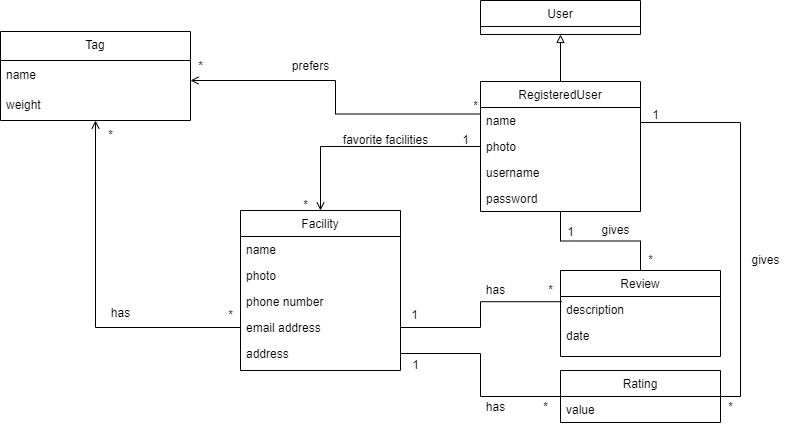

## Requirements

### Domain model
- The User class represents any user of the application. It has no attributes because it can only search facilities or register to create an account.
- The Registered User class represents a specific type of user who has registered an account. This class is used to store and retrieve user information and preferences, such as the ratings and reviews they wrote for each facility, a list of favorite facilities and a list of their favourite tags, as well as to perform interactions with the business.
- The Facility class represents a sport facility in the business. This class is used to store and retrieve facility information like their name and adress, as well as to perform operations related with facilities. The facility also contains a list of tags which categorize it based on which sports on you can play there, for example, a list of ratings given towards that facility, and a list of reviews written about the facility.
- The Tag class represents a tag which is used to categorize facilities. This class is used to allow filtered searches of facilities based on their tags.
- The Review class represents a review made by a registered user to a certain facility. This class is used to store and retrieve information related to each review, including which user user wrote it and when, as well as the facility it was written towards.
- The Rating class represents a rating given by a registered user to a certain facility. This class is used to store and retrieve the value of a rating given by a registered user to a certain facility. This class is similar to the review class. However, unlike the review, this class does not contain a date attribute, since, for each registered user and facility, we only want their latest rating to count towards a facility's overall rating.

